# 📊 Dashboard LTE – Sistem Pengelolaan & Pendataan Siswa

Dashboard LTE adalah aplikasi berbasis web yang dibuat untuk mempermudah pengelolaan data siswa di lingkungan sekolah. Dibangun menggunakan **HTML, CSS, JavaScript, PHP**, dan **MySQL** sebagai database-nya.

---

## ✨ Fitur Utama

✅ Login dan Autentikasi Pengguna  
✅ Dashboard Admin Interaktif  
✅ Manajemen Data Siswa  
✅ Manajemen Data Agama  
✅ Manajemen Data Jurusan  
✅ Manajemen Data Akun  
✅ Tampilan Tabel Dinamis  
✅ CRUD (Create, Read, Update, Delete) data siswa dan lainnya  

---

## 🖼️ Screenshot Antarmuka

### 🔐 Halaman Login

  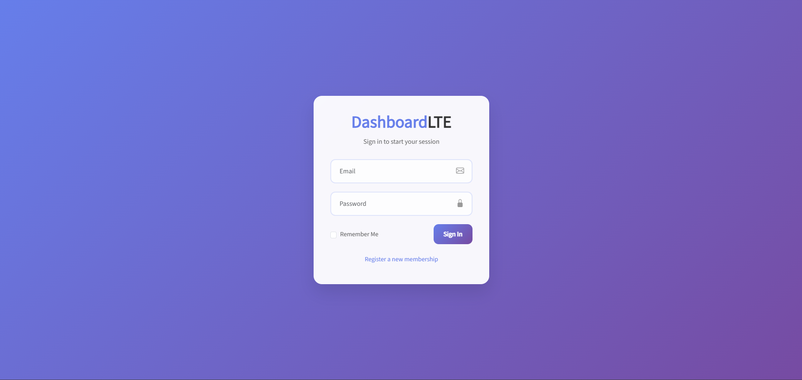

---

### 📋 Dashboard

  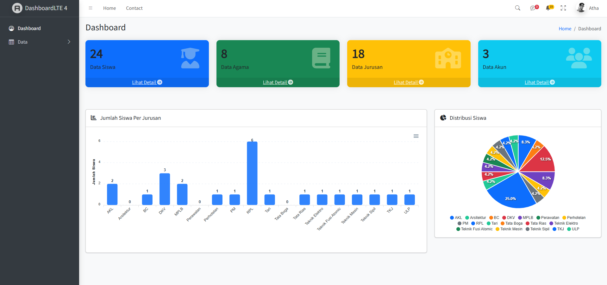

---

### 👨‍🎓 Tabel Data Siswa
<table align="center">
  <tr>
    <th>List Data Siswa</th>
    <th>Form Tambah Data</th>
    <th>Edit Data Siswa</th>
  </tr>
  <tr>
    <td align="center">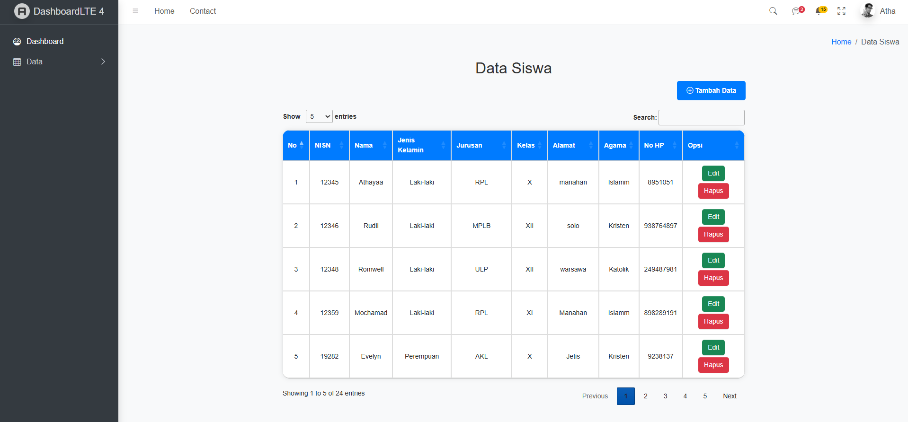</td>
    <td align="center">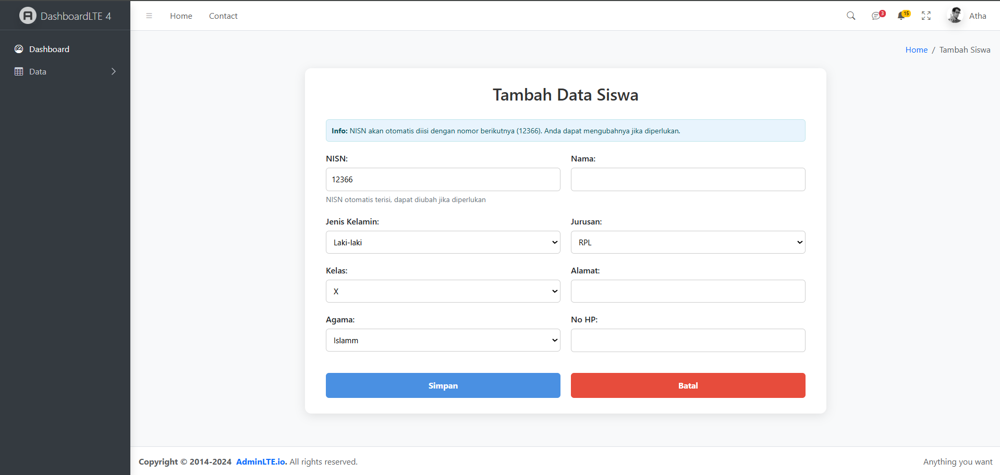</td>
    <td align="center">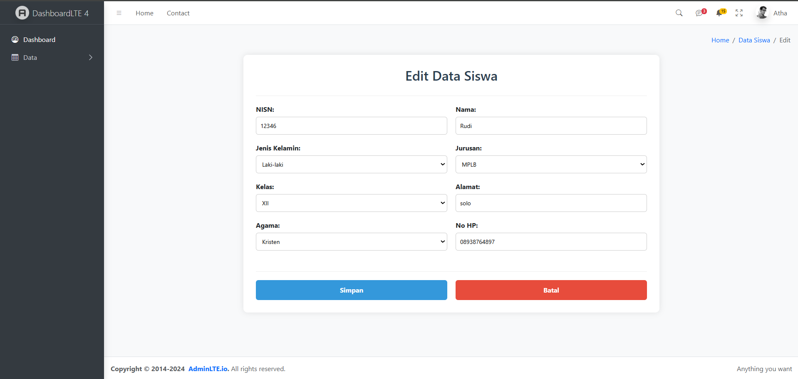</td>
  </tr>
</table>

---

### 🛐 Tabel Data Agama
<table align="center">
  <tr>
    <th>List Data Agama</th>
    <th>Form Tambah Agama</th>
    <th>Edit Data Agama</th>
  </tr>
  <tr>
    <td align="center"></td>
    <td align="center">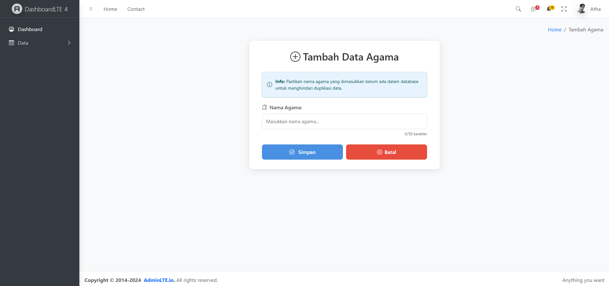</td>
    <td align="center">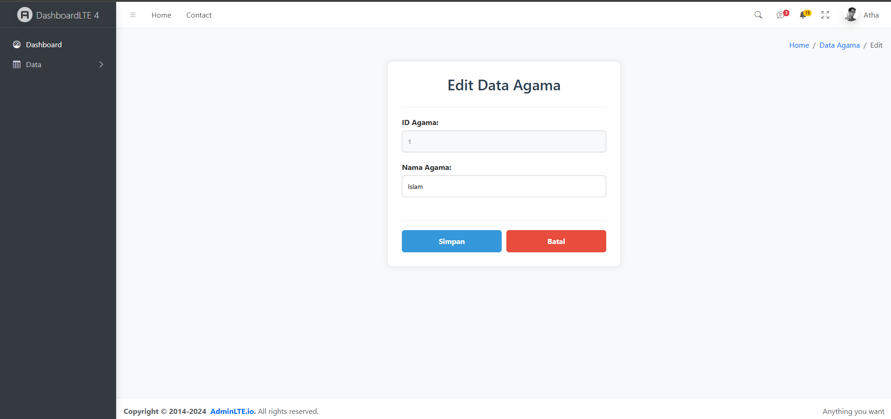</td>
  </tr>
</table>

---

### 🏫 Tabel Data Jurusan
<table align="center">
  <tr>
    <th>List Data Jurusan</th>
    <th>Form Tambah Jurusan</th>
    <th>Edit Data Jurusan</th>
  </tr>
  <tr>
    <td align="center">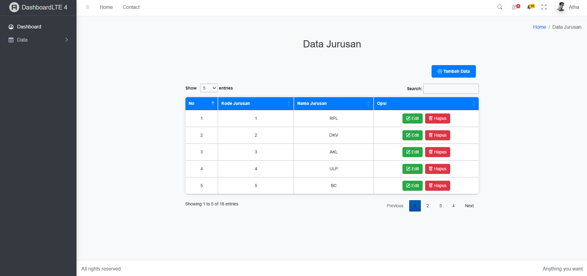</td>
    <td align="center">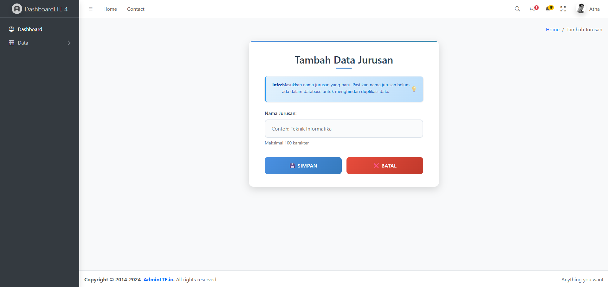</td>
    <td align="center"></td>
  </tr>
</table>

---

### 🧑‍💻 Tabel Data Akun
<table align="center">
  <tr>
    <th>List Data Akun</th>
    <th>Form Tambah Akun</th>
    <th>Edit Data Akun</th>
  </tr>
  <tr>
    <td align="center">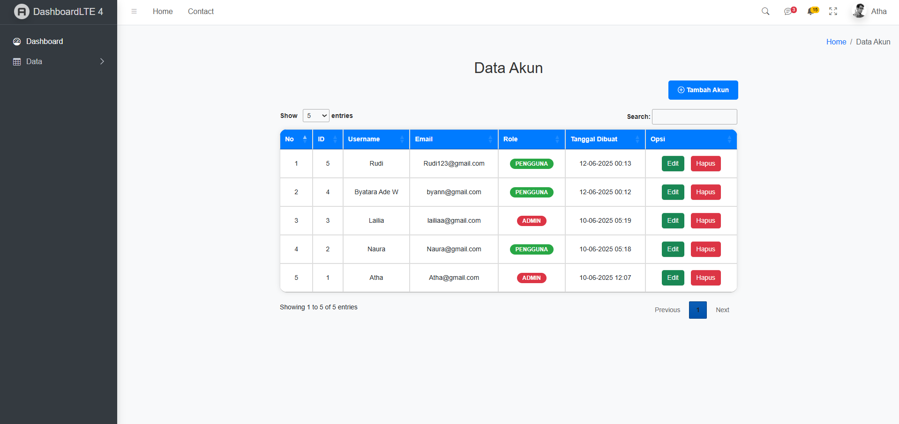</td>
    <td align="center">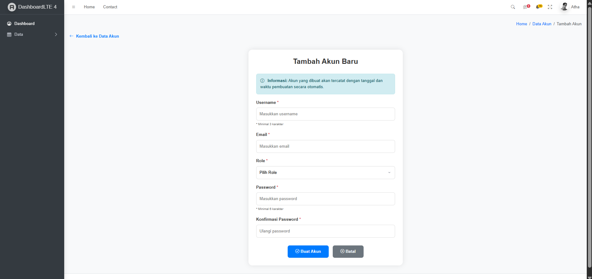</td>
    <td align="center">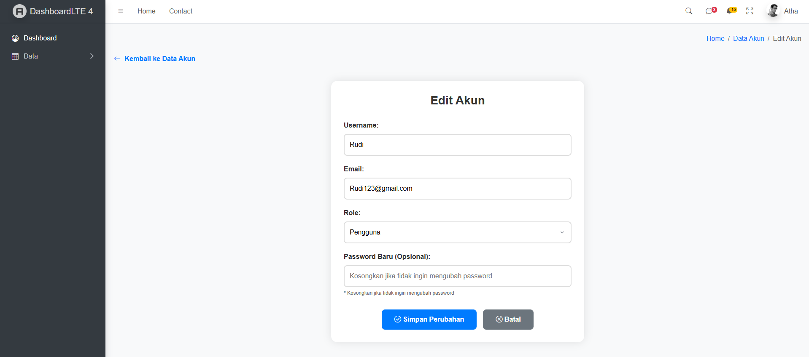</td>
  </tr>
</table>

---

## 🛠️ Teknologi yang Digunakan

- **Frontend**: HTML, CSS, JavaScript  
- **Backend**: PHP  
- **Database**: MySQL  
- **Hosting/Server**: XAMPP / Localhost
